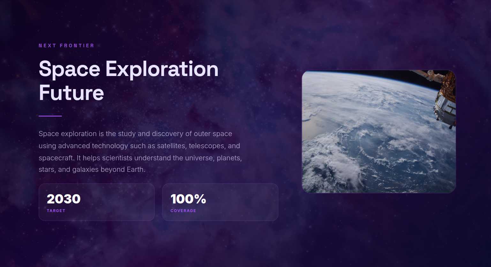

# 🧞‍♂️ SlideGenie  
### *AI-Powered Presentation Generation Platform*

<p align="center">
  <a href="https://youtu.be/1XqbWz1Pc48">
    
  </a>
</p>

<p align="center">
  Turn ideas into stunning, layout-perfect presentations in seconds 🚀
</p>

---

## ✨ Overview

**SlideGenie** is a next-generation AI-powered presentation builder that transforms raw ideas into **beautiful, structured slides instantly**.

From **theme generation** to **layout composition** and **pixel-perfect PDF export**, SlideGenie eliminates the friction of traditional presentation design.

---

## 🔥 Why SlideGenie?

- 🧠 **AI does the heavy lifting** — you focus on ideas  
- 🎨 **Auto-generated themes & layouts**  
- ⚡ **Instant visual feedback** with live preview  
- 📄 **Export-ready PDFs** with perfect formatting  
- 🧩 **Modular architecture** for scalability  

---

## 🌟 Features

### 🤖 AI-Powered Generation
- Generate full slide decks from simple prompts  
- Smart layout structuring with contextual understanding  

### 🎯 Real-Time Editor
- Interactive editing environment  
- Instant preview of slides as you build  

### 📄 Pixel-Perfect Export
- High-quality PDF generation using **WeasyPrint**  
- Maintains layout integrity and styling  

### 🖼️ Export Anywhere
- Beautiful PDF carousel viewer  
- Multiple layout views for easy navigation  

### ⚙️ Modern Tech Stack
- **Frontend:** React, TailwindCSS, Radix UI  
- **Backend:** FastAPI, Langchain  (AI integration)  
- Built for performance, scalability, and clean UX  

---

## 🏗️ Project Structure

```
SlideGenie/
├── frontend/   → React + Tailwind UI
├── backend/    → FastAPI + MongoDB Atlas+ AI Engine
```


- [`/frontend`](./frontend/README.md) → User interface  
- [`/backend`](./backend/README.md) → AI + API layer  

---

## 🚀 Getting Started

### 🔧 Backend Setup

```bash
cd backend
python -m venv .venv
source .venv/bin/activate   # Windows: .venv\Scripts\activate

uv sync

cp .env.example .env

python -m src.api.main
````

📍 Runs on: **[http://localhost:8000](http://localhost:8000)**

---

### 💻 Frontend Setup

```bash
cd frontend
npm install
npm start
```

📍 Runs on: **[http://localhost:3000](http://localhost:3000)**

---

## 📄 Explore Sample Slide Decks Created with SlideGenie

[](https://drive.google.com/file/d/1-Hc6GwObKe8UaV06Zn-34Eg6C7njxJG0/view?usp=sharing)

[](https://drive.google.com/file/d/1Mr5Ea4vPs_pox55VQO6RnLXAmKNtdXAa/view)


[](https://drive.google.com/file/d/1qxOooaRXvAaaYSbrmRfSaVjdEw5XuxVO/view?usp=sharing)

[](https://drive.google.com/file/d/1w3yrVHkO9oxrTbJaubtm7IBLYA56mzx4/view?usp=sharing)

---

## 🧠 How It Works

1. Enter your idea or topic
2. AI generates structured slide content
3. Customize in real-time editor
4. Export as polished PDF

---

## 🚧 Future Improvements

* 🗂️ Template marketplace
* 🌐 Cloud sync & collaboration
* 🎙️ Voice-to-presentation generation
* 📊 Advanced slide analytics
* 🧠  Research Agent Intregation

---

## 🤝 Contributing

Contributions are welcome!
Feel free to open issues or submit pull requests to improve SlideGenie.

---

## 📜 License

This project is licensed under the **MIT License**.

---

## 💡 Inspiration

Built to eliminate the pain of:

* Spending hours designing slides
* Struggling with layouts
* Reformatting content repeatedly

